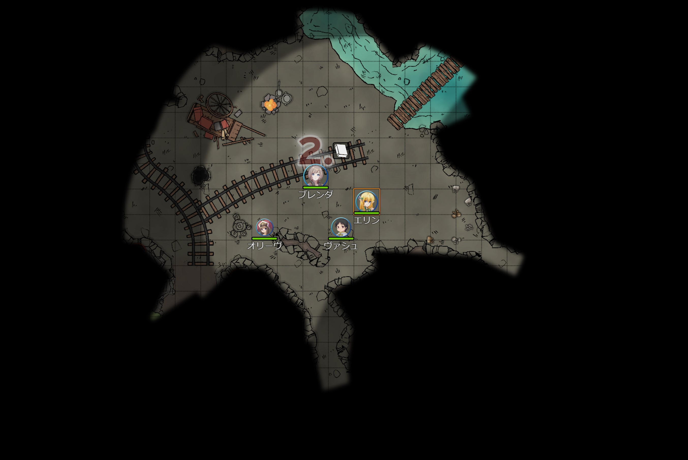
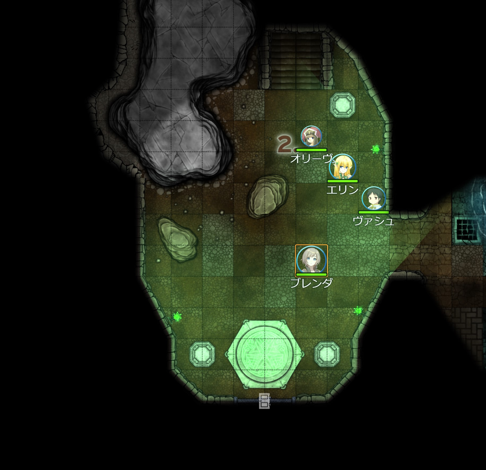
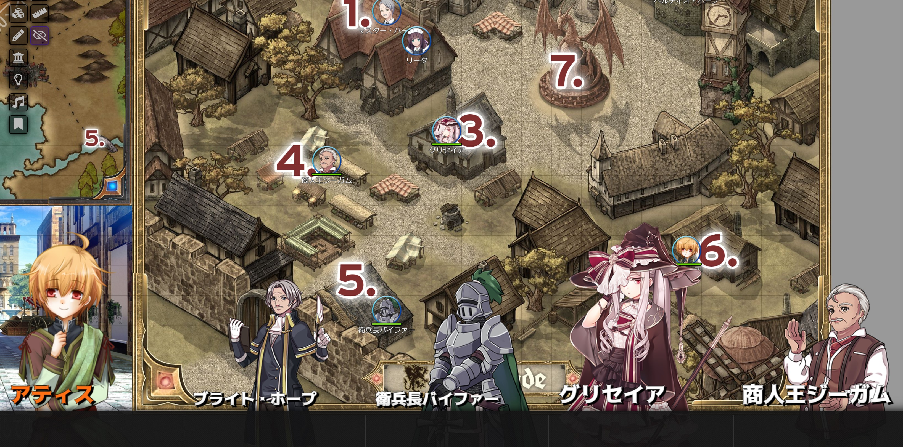

# 竜祭（Dragon Festival）
## D&D5版　レベル３～５　ショートキャンペーン

* **製作者**: Brother Sharp (ディスコード：Brother Sharp#6921)
* **対応dnd5eバージョン**: 0.96+
* **ワールドバージョン**: 1.0.0 

### インストール方法

以下のリンクをワールドとしてインストールしてください。

* リンク： https://raw.githubusercontent.com/BrotherSharper/dragonfestival1/master/world.json

### 物語
*こはアーネスト地方の小さな町、ドラグレイド。嘗てこの町を脅かす恐ろしい邪竜が闊歩していたが、伝説の武具を手にその悪逆に立ち向かった英雄たちによって滅ぼされた。*
*英雄たちを称えるためにこの町では後に「竜祭」が毎年開催されるようになった…*

*この物語はドラグレイドの危機と邪竜を打破するために立ち上がった一人の勇敢な鍛冶師と、彼とともに旅をした後の英雄たちが如何にしてその名誉を掴み取るに至ったのかを追っていく物語である。伝説の武具とは、邪竜の正体とは…そして、ドラグレイドの人々の思いとは…そのすべてをこの物語で解き明かしていこうではないか。*

この冒険は辺境の土地であるアーネスト地方の小さな街「ドラグレイド」で起こる出来事を追っていく物語です。この冒険を遊ぶプレイヤー達は若き鍛冶師である アティスとであい、彼に協力し、その境遇を打破するための王道の冒険を行います。

レベル３冒険者から始まり、最終的にはレベル５冒険者として活躍しつつ冒険を終えます。RP、戦闘、探索のすべての柱を一通り網羅し、D&Dの初心者だけではなく、経験者も等しく楽しめるストーリーです。

### 内容物
* レベル３～５の冒険。
* ダンジョン2種。
* マジックアイテム12種（別途シナリオ専用アイテムもある）。
* データ込のネームドNPC15人ほど、汎用NPCも多数収録、立ち絵モッド（Theatre Inserts）を使用している場合は立ち絵設定済みなのでそのまま使用できる。
* 新クラス「クラフター」、武器や防具を制作することで自分とパーティを強化できる。サンプルNPCも収録。
* ショートカットリンク済みのハンドアウト、これを読むだけでシナリオを進行できる。
* BGM30種、それぞれの雰囲気に合わせて用意されてる。
* 和製TRPGなどで使用されるHOを取り入れ、より物語に入り込める。
* 遊びやすくするための新ルールを収録（HPゲージ持ちのボス、NPCとタッグを組むシステム）。
* 初心者サマリーを収録。

インストールして、プレイヤーを集めて、キャラを作ればそのまま遊べるものです。DMは先に展開だけを軽く読んでおけば遊びやすくなりますがそれ以外の準備は一切必要ないすべてが用意されたワールドです。
ここにあるダンジョン、マジックアイテム、NPC等のデータ累はすべてここから摘出し自分の別の卓でも使用しても良い。FVTT外で使用する素材利用のドキュメントを読み、有料のものは自分で購入すること。

### 本体の日本語化
オンセ工房FoundryVTT本体の日本語化はこちらからどうぞ

* https://github.com/BrotherSharper/foundryVTTja